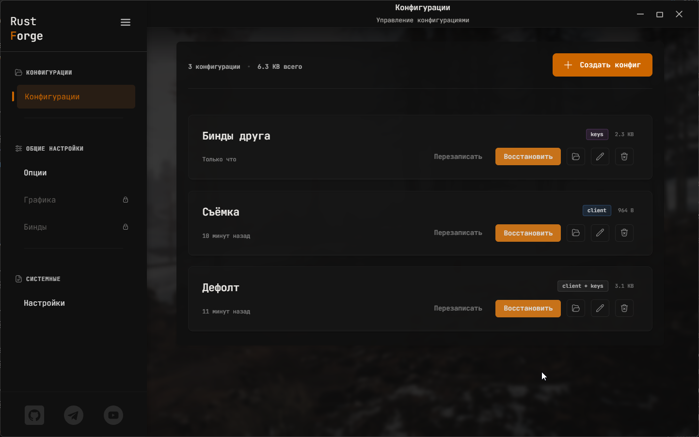
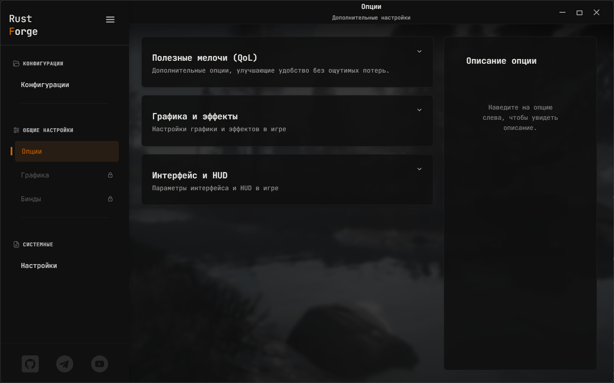
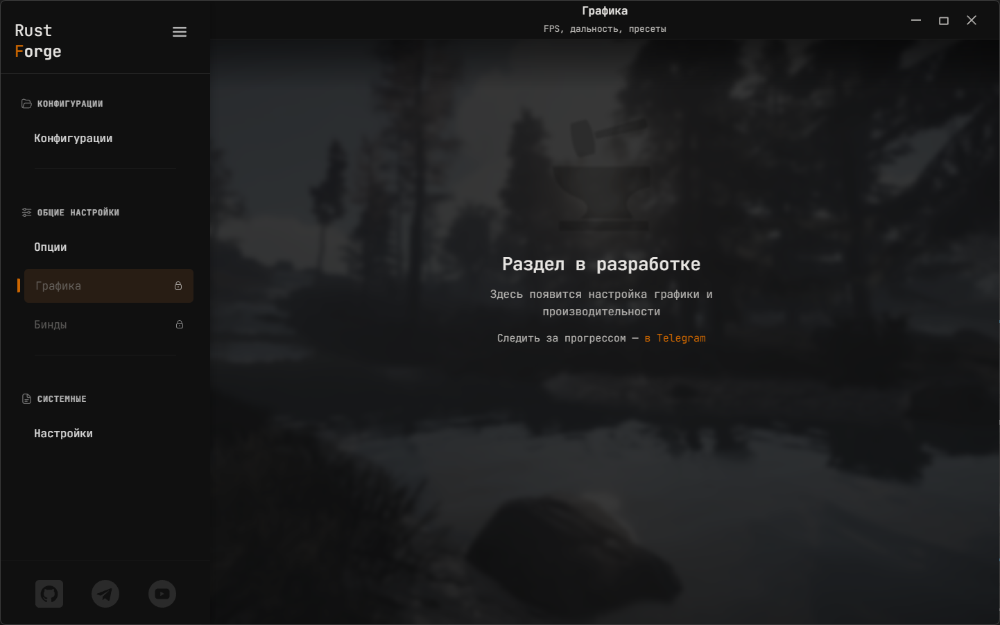
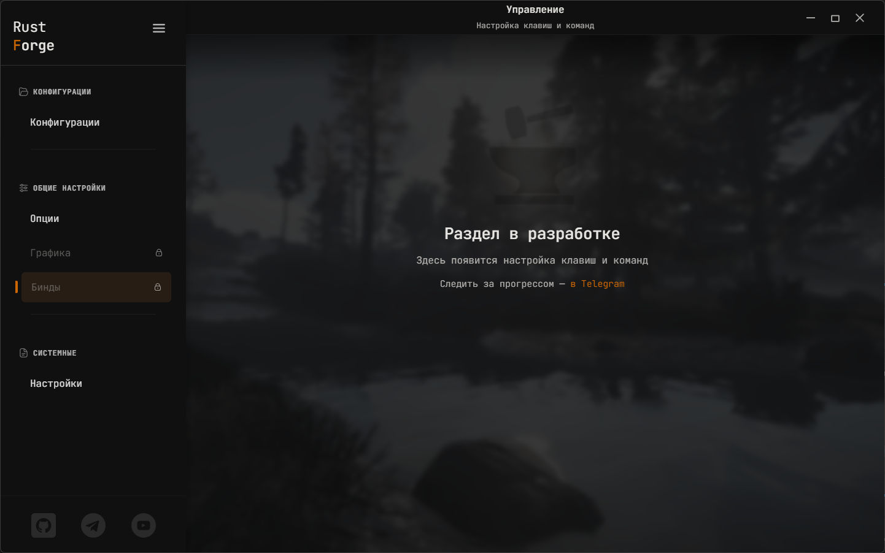
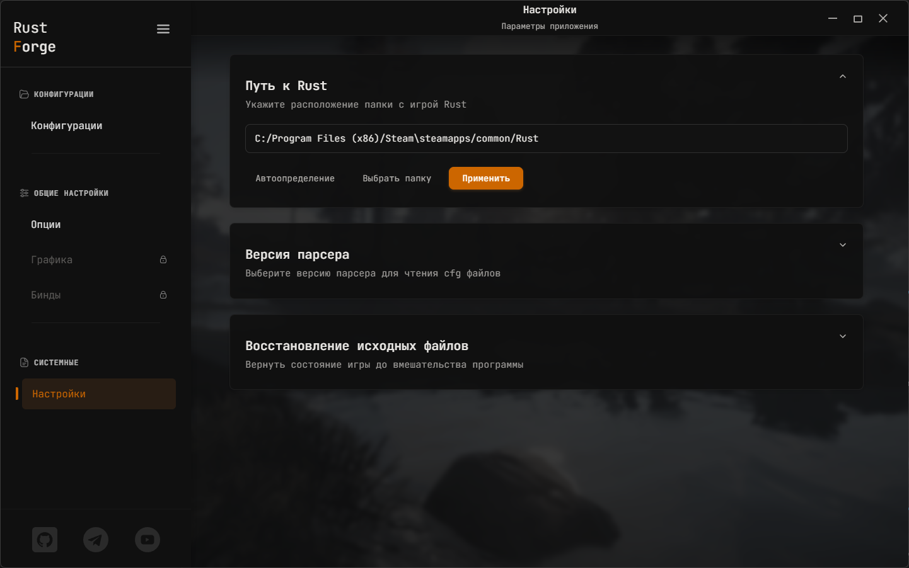

# Rust Forge

**Rust Forge** — удобная и безопасная утилита для настройки Rust.  
Конфигурации, бинды, графика, пресеты и системные параметры — всё собрано в одном минималистичном интерфейсе.

Приложение **не работает в фоне**, **не читает** и **не изменяет память игры**,  
что полностью исключает любые триггеры античита **EAC** и других систем защиты.

---

## Скачать программу

  

---

## Скриншоты

### Конфигурации

### Меню опций

### Графика и пресеты

### Бинды

### Настройки приложения

---

## Основные возможности

- **Управление конфигурациями игры**
- **Быстрое создание, редактирование и применение конфигов**
- **Автоматическое создание резервных копий**
- **Редактор биндов**  
  Сложные действия, словарь команд, подсказки клавиш *(в разработке)*
- **Настройки графики и пользовательских пресетов** *(в разработке)*

---

## Следите за обновлениями

- 📢 **Telegram канал:** [@rust_forge](https://t.me/rust_forge)